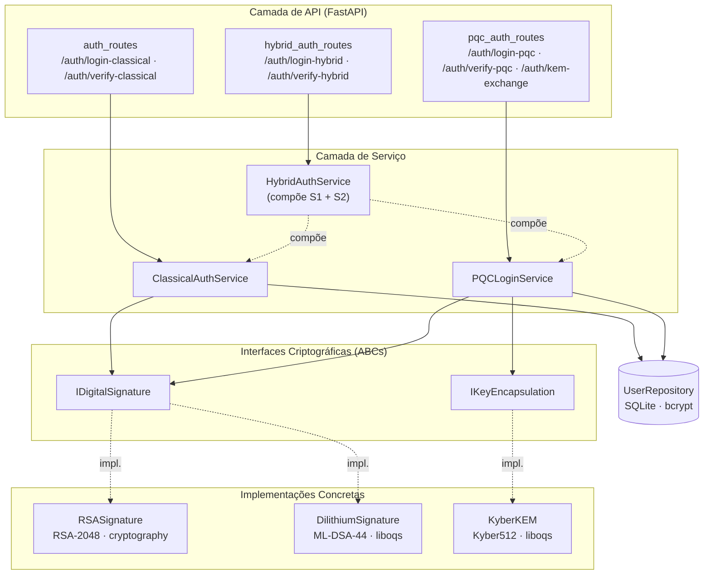

# 4. Metodologia

## 4.1 Caracterização da Pesquisa

Este trabalho caracteriza-se como uma pesquisa aplicada, de natureza quantitativa e com objetivo descritivo-comparativo. A abordagem adotada combina o desenvolvimento de um sistema funcional de autenticação web com a coleta sistemática de métricas de desempenho em condições controladas, permitindo comparações diretas entre algoritmos criptográficos clássicos e pós-quânticos.

A escolha por uma pesquisa experimental justifica-se pela natureza do problema investigado: avaliar o comportamento prático de algoritmos pós-quânticos requer mais do que microbenchmarks isolados, exigindo um cenário realista de uso em que as operações criptográficas estejam integradas ao fluxo completo de autenticação. Desse modo, a pesquisa não se limita a executar primitivas criptográficas em isolamento, mas as exercita dentro de uma aplicação que reflete o uso esperado em sistemas web reais — geração e verificação de tokens, troca de chaves de sessão e composição de modos híbridos de operação.

A natureza quantitativa decorre da coleta de métricas mensuráveis e reproduzíveis: latência em milissegundos, consumo de memória em bytes e tamanhos de payload em bytes. Já o caráter descritivo-comparativo manifesta-se na análise paralela das três abordagens implementadas, com o objetivo de identificar diferenças sistemáticas entre paradigmas criptográficos, e não de propor um novo algoritmo.

## 4.2 Arquitetura do Sistema Implementado

O sistema desenvolvido segue os princípios da Clean Architecture, organizando o código em camadas com responsabilidades bem definidas e dependências unidirecionais. A camada de interface (API) expõe os endpoints REST consumidos pelos clientes; a camada de serviço (Auth Service) implementa a lógica de autenticação; a camada de criptografia define contratos abstratos por meio de interfaces; e as implementações concretas dessas interfaces encapsulam o uso das bibliotecas criptográficas externas, conforme ilustrado na Figura 4.1.

Figura 4.1 — Organização em camadas do sistema de autenticação implementado.
Fonte: Elaborado pelo autor (2026).

A separação entre interface e implementação concentra-se em dois contratos abstratos. A interface `IDigitalSignature` define as operações comuns a qualquer algoritmo de assinatura digital — geração de par de chaves, assinatura de mensagem e verificação de assinatura — sem expor detalhes internos do algoritmo subjacente. De forma análoga, a interface `IKeyEncapsulation` define as operações de geração de chaves, encapsulamento e decapsulamento para mecanismos KEM. Essa abstração foi adotada como aplicação direta do princípio de inversão de dependência, segundo o qual módulos de alto nível não devem depender de módulos de baixo nível, mas sim de abstrações.

A escolha arquitetural tem motivação metodológica clara: a substituição de um algoritmo criptográfico — por exemplo, a troca do RSA-2048 pelo ML-DSA-44 — não exige modificações nas camadas de serviço ou de API. Apenas a implementação concreta da interface é alterada, garantindo que os experimentos comparativos sejam realizados sobre o mesmo fluxo de autenticação, isolando o efeito do algoritmo em si das demais variáveis do sistema.

A separação em camadas tem implicação direta para a validade interna dos benchmarks: ao encapsular as implementações criptográficas em interfaces intercambiáveis, o sistema garante que a lógica de autenticação — validação de credenciais, montagem de payload, codificação base64url, retorno HTTP — seja idêntica nos três modos avaliados. Assim, as diferenças de desempenho observadas entre os modos são atribuíveis exclusivamente à primitiva criptográfica subjacente, e não a variações na lógica de controle ou na estrutura de dados do token. Esse isolamento arquitetural é o que torna metodologicamente lícita a comparação direta entre os números coletados para cada algoritmo.

A persistência dos usuários cadastrados é realizada em banco de dados SQLite, com armazenamento de senhas por meio do algoritmo bcrypt para hashing. Embora o gerenciamento de usuários não seja foco da avaliação experimental, sua presença é necessária para que o fluxo de autenticação corresponda a um cenário realista. A camada de banco foi mantida deliberadamente simples justamente para que não se torne uma fonte de variabilidade nos benchmarks.

## 4.3 Implementação dos Modos de Autenticação

Foram implementados três modos de autenticação que compartilham a mesma arquitetura subjacente, diferindo apenas nos algoritmos criptográficos empregados e na forma como combinam suas operações. Os três modos coexistem no mesmo sistema e podem ser exercitados de forma independente, o que viabiliza a comparação direta sem viés introduzido por mudanças de plataforma ou ambiente entre os experimentos.

### 4.3.1 Modo Clássico (RSA-2048 + JWT RS256)

O modo clássico funciona como linha de base de comparação e adota dois pilares amplamente utilizados em sistemas web atuais: o algoritmo de assinatura RSA com chave de 2048 bits e o padrão JSON Web Token assinado com o esquema RS256, conforme definido pela RFC 7519. O par de chaves RSA é gerado uma única vez na inicialização do serviço, decisão consistente com o padrão observado em servidores de produção, nos quais a geração de chaves é amortizada ao longo de todo o tempo de execução do processo.

No fluxo de login, após a validação das credenciais do usuário pelo bcrypt, o serviço constrói um payload JWT contendo o identificador do usuário, o instante de emissão e o instante de expiração do token. Esse payload é assinado com a chave privada RSA por meio da biblioteca PyJWT, que internamente delega a operação criptográfica à biblioteca `cryptography`. Já a verificação do token, realizada nas requisições subsequentes, decodifica o JWT e verifica a integridade da assinatura com a chave pública correspondente, recusando o acesso caso o token tenha sido adulterado ou esteja expirado.

A escolha do RSA-2048 como referência clássica baseia-se no fato de que esse parâmetro é amplamente recomendado por órgãos normativos para uso até cerca de 2030, sendo portanto representativo do estado da prática atual em sistemas web. O esquema RS256, por sua vez, é o algoritmo mais comum entre tokens JWT em produção, o que reforça a relevância da comparação.

Cabe registrar uma distinção de implementação relevante para a interpretação dos resultados do Capítulo 5. A assinatura no fluxo de serviço (`jwt_sign` e `jwt_verify`) é produzida pela biblioteca PyJWT no esquema RS256, que adota o preenchimento PKCS#1 v1.5; já as operações de primitiva isolada (`raw_rsa_sign` e `raw_rsa_verify`, Seção 4.5) empregam a implementação RSA da biblioteca `cryptography` com preenchimento RSA-PSS. A escolha do esquema de preenchimento não altera de forma material o custo computacional da operação — dominado, em ambos os casos, pela mesma exponenciação modular com a chave privada de 2048 bits —, de modo que a medição na camada de primitiva permanece representativa do RS256 e a comparação frente ao ML-DSA-44 mantém-se válida.

### 4.3.2 Modo PQC Puro (ML-DSA-44 + Kyber512)

O modo pós-quântico puro substitui completamente os algoritmos clássicos por suas contrapartes resistentes a ataques quânticos, mantendo o fluxo de autenticação inalterado. A assinatura digital é realizada pelo ML-DSA-44, padronizado pelo NIST como FIPS 204, e o encapsulamento de chaves emprega o ML-KEM-512 (anteriormente conhecido como Kyber512), padronizado como FIPS 203. Ambos os algoritmos são utilizados por meio da biblioteca liboqs, na versão 0.15.0, acessada a partir de Python pelo binding `liboqs-python` 0.14.1.

A geração do token PQC adota um formato customizado em base64url, semelhante em estrutura ao JWT clássico, mas dimensionado para acomodar o tamanho da assinatura ML-DSA-44 — aproximadamente 2.420 bytes, contra os 256 bytes de uma assinatura RSA-2048. O token é composto por três partes codificadas — cabeçalho, payload e assinatura — concatenadas por pontos. A escolha por um formato próprio foi necessária porque o padrão JWT, em sua especificação atual, ainda não contempla algoritmos pós-quânticos como tipos de assinatura registrados.

Adicionalmente ao fluxo de tokens, este modo expõe um endpoint dedicado à troca de chaves por meio do Kyber512, no qual o servidor gera um par de chaves KEM, recebe um ciphertext do cliente, e realiza o decapsulamento para derivar uma chave simétrica compartilhada. Esse endpoint não é parte do fluxo de autenticação por token em si, mas representa um caso de uso complementar — o estabelecimento de canais de sessão pós-quânticos — que é crítico para a discussão sobre migração completa de protocolos.

### 4.3.3 Modo Híbrido

O modo híbrido emprega simultaneamente o algoritmo clássico e o pós-quântico em cada operação de autenticação, com o objetivo de avaliar o custo de uma estratégia de migração gradual. A implementação utilizada não corresponde ao modelo de "dupla assinatura", em que um único token recebe duas assinaturas concatenadas, mas sim ao modelo de "tokens duplos", em que o servidor responde a cada login com dois tokens independentes — um JWT RS256 e um token ML-DSA-44 — entregues conjuntamente ao cliente.

Essa escolha foi orientada por dois fatores. Em primeiro lugar, a estratégia de tokens duplos permite verificação independente: caso uma das duas verificações falhe, o sistema pode tomar decisões diferenciadas, como bloquear a requisição ou registrá-la para auditoria. Em segundo lugar, esse modelo é mais alinhado com cenários reais de migração, nos quais clientes em diferentes estágios de adoção podem usar apenas um dos dois tokens enquanto a infraestrutura é gradualmente atualizada.

A implementação do serviço híbrido compõe os serviços clássico e pós-quântico por meio de injeção de dependência, sem reescrever a lógica criptográfica subjacente. A latência total observada no modo híbrido equivale, portanto, à soma das latências individuais somada ao custo de orquestração — custo esse que se mantém baixo, pois o fluxo de autenticação não introduz operações adicionais além das já presentes em cada modo isolado.

## 4.4 Protocolo de Benchmarking

A coleta de medições de desempenho seguiu um protocolo único para todas as operações avaliadas, projetado para garantir comparabilidade entre algoritmos e reprodutibilidade entre execuções. O protocolo é composto por quatro elementos principais: a configuração de execução, o instrumento de medição de tempo, o instrumento de medição de memória e o procedimento de validação de reprodutibilidade.

### 4.4.1 Configuração Experimental

Cada operação foi avaliada em uma sequência de 100 iterações de medição por execução, precedidas por 10 iterações adicionais de aquecimento (warmup) cujos resultados são descartados. O protocolo completo foi repetido em três execuções independentes — conforme detalhado na Seção 4.4.4 —, totalizando 300 observações por operação e 6.000 amostras brutas no conjunto experimental, considerando as 20 operações listadas na Seção 4.5. O período de warmup foi adotado para mitigar efeitos transitórios de inicialização — como a carga preguiçosa de bibliotecas, a alocação de buffers internos e a otimização de caminhos de execução pelo interpretador Python — que tendem a inflacionar artificialmente a latência das primeiras execuções e que não correspondem ao regime permanente observado em sistemas em produção.

O instrumento de medição de tempo foi a função `time.perf_counter()` da biblioteca padrão do Python, escolhida por oferecer a maior resolução temporal disponível na plataforma utilizada e por ser monotônica, isto é, garantida contra ajustes de relógio do sistema durante a medição. A janela de timing foi posicionada para envolver exclusivamente a operação criptográfica em si, excluindo deliberadamente a serialização HTTP, o acesso ao banco de dados, a verificação de credenciais por bcrypt e demais operações que não fazem parte do escopo da avaliação. Esse isolamento foi obtido aplicando o timing dentro da camada de serviço, no entorno imediato da chamada à interface criptográfica.

A partir das 100 amostras coletadas para cada operação, foram calculadas as estatísticas descritivas de média, mediana, desvio padrão, percentil 95 e percentil 99. A média fornece uma visão central tradicional, enquanto a mediana é menos sensível a outliers, frequentes em medições de latência sub-milissegundo. Os percentis P95 e P99 foram incluídos por serem métricas amplamente adotadas em engenharia de desempenho de sistemas web, refletindo o comportamento da cauda da distribuição — particularmente relevante para serviços nos quais a experiência do usuário depende não apenas do caso médio, mas também dos piores casos esporádicos.

### 4.4.2 Medição de Memória

A medição de consumo de memória foi realizada com o módulo `tracemalloc` da biblioteca padrão do Python, que rastreia as alocações realizadas pelo interpretador e permite obter o pico de consumo durante uma janela arbitrária de execução. A métrica adotada foi o pico de alocação (peak bytes) registrado entre o início e o término da operação criptográfica.

Uma decisão metodológica relevante foi separar a medição de tempo da medição de memória em passes independentes. Quando o `tracemalloc` está ativo, ele introduz um pequeno overhead em cada alocação realizada pelo interpretador, o que distorce as medições de latência sub-milissegundo. Para evitar essa interferência, o protocolo executa primeiro um pass dedicado à coleta de tempos, com o `tracemalloc` desativado, e em seguida um pass dedicado à coleta de memória, com timing desativado. Cada métrica é obtida nas condições em que ela pode ser medida com maior fidelidade.

O pass de memória utilizou um número reduzido de iterações por operação, suficiente para obter o pico de alocação sem introduzir ruído por instabilidade do garbage collector. Esse pico é uma métrica conservadora, no sentido de que estima o pior caso de pressão sobre a memória durante a execução de uma operação isolada — informação útil para dimensionamento de recursos em servidores que processam múltiplas autenticações concorrentes.

### 4.4.3 Ambiente de Execução

Todos os experimentos foram executados em um único ambiente de hardware e software, descrito na Tabela 4.1. A uniformidade do ambiente é necessária para que as comparações entre algoritmos não sejam contaminadas por variações de plataforma; em contrapartida, as conclusões derivadas dos números absolutos coletados são específicas para esse ambiente, e a generalização para outras plataformas exige cautela e, idealmente, replicação experimental — limitação que será discutida no Capítulo 6.

**Tabela 4.1** — Componentes do ambiente experimental.

| Componente | Versão / Configuração |
|------------|----------------------|
| Arquitetura de hardware | Apple Silicon (ARM64) |
| Sistema operacional | macOS 15 (Darwin 25) |
| Python | 3.13 |
| liboqs (núcleo C) | 0.15.0 |
| liboqs-python (binding) | 0.14.1 |
| PyJWT | 2.12.1 |
| cryptography | 46.0.5 |
| bcrypt | 5.0.0 |

Fonte: Elaborado pelo autor (2026).

A biblioteca liboqs foi compilada a partir do código-fonte oficial do projeto Open Quantum Safe, e não instalada por meio de pacotes pré-compilados. Essa escolha foi feita para garantir que as implementações de ML-DSA-44 e Kyber512 utilizadas correspondessem exatamente à versão alinhada com a padronização NIST de 2024. A versão 0.15.0 da liboqs C apresenta uma divergência cosmética em relação à versão 0.14.1 do binding Python, mas o núcleo matemático dos algoritmos avaliados é idêntico em ambas, o que foi verificado com base na documentação oficial da liboqs e na correspondência declarada entre os nomes dos algoritmos nas duas versões.

A escolha pela arquitetura ARM64 (Apple Silicon) é relevante para a interpretação dos resultados absolutos coletados. Algoritmos lattice-based como o ML-DSA-44 e o Kyber512 fazem uso intensivo de operações sobre polinômios em corpos finitos, padrão computacional que se beneficia de instruções SIMD — em particular, das extensões NEON disponíveis nos processadores Apple M-series. Implementações otimizadas da liboqs aproveitam essas instruções quando detectam a plataforma, o que tende a estreitar a distância de desempenho entre algoritmos pós-quânticos e clássicos em relação ao que seria observado em arquiteturas sem aceleração vetorial equivalente. Esse efeito é retomado na análise comparativa do Capítulo 5 e discutido como limitação de generalização na Seção 4.6.

### 4.4.4 Validação de Reprodutibilidade

Para verificar a estabilidade dos resultados ao longo do tempo e em condições levemente diferentes de execução, todo o protocolo de medição foi repetido em três execuções independentes. As execuções foram realizadas em momentos distintos, com reinicialização do processo Python entre elas, garantindo que efeitos como acúmulo de cache, fragmentação de memória ou variações de carga térmica do hardware fossem amostrados.

A métrica de validação de reprodutibilidade utilizada foi o coeficiente de variação (CV), definido como o quociente entre o desvio padrão e a média de uma operação considerando suas três execuções. O CV foi escolhido por ser uma métrica adimensional que normaliza a dispersão pela escala da grandeza medida, permitindo comparar diretamente a estabilidade de operações com latências em ordens de magnitude diferentes. Adotou-se como critério de classificação que operações com CV inferior a 10% sejam consideradas altamente reprodutíveis. Esse limiar é coerente com a literatura de engenharia de desempenho, na qual variações superiores a 10% costumam indicar interferência de variáveis não controladas, exigindo investigação adicional.

## 4.5 Operações Avaliadas

O conjunto de operações avaliadas foi organizado em duas categorias complementares, denominadas neste trabalho como camada de serviço e camada bruta. A camada de serviço corresponde à operação criptográfica integrada ao fluxo completo de autenticação — incluindo, por exemplo, a codificação base64url de um token JWT após sua assinatura. Já a camada bruta corresponde à primitiva criptográfica isolada, sem o overhead de codificação, formatação ou montagem de payload. A medição em ambas as camadas permite distinguir o custo intrínseco do algoritmo do custo agregado pelo formato de token utilizado, informação relevante para identificar oportunidades de otimização específicas.

A Tabela 4.2 lista as 20 operações que compõem o conjunto experimental, agrupadas por modo de autenticação. As operações marcadas como camada de serviço refletem o cenário de uso real em uma API web, ao passo que as operações marcadas como camada bruta servem como referência inferior do custo computacional do algoritmo.

**Tabela 4.2** — Operações criptográficas avaliadas no protocolo experimental.

| Operação | Algoritmo | Camada | Contexto |
|----------|-----------|--------|----------|
| `jwt_sign` | RSA-2048 / RS256 | Serviço | Geração de token JWT no login clássico |
| `jwt_verify` | RSA-2048 / RS256 | Serviço | Verificação de token JWT em requisições autenticadas |
| `pqc_sign` | ML-DSA-44 | Serviço | Geração de token PQC no login pós-quântico |
| `pqc_verify` | ML-DSA-44 | Serviço | Verificação de token PQC |
| `kem_keygen` | Kyber512 | Serviço | Geração de par de chaves KEM no servidor |
| `kem_encapsulate` | Kyber512 | Serviço | Encapsulamento da chave simétrica pelo cliente |
| `kem_decapsulate` | Kyber512 | Serviço | Decapsulamento da chave simétrica pelo servidor |
| `hybrid_sign_classical` | RS256 | Serviço | Componente clássico (RS256) na geração de tokens duplos no login híbrido |
| `hybrid_sign_pqc` | ML-DSA-44 | Serviço | Componente PQC (ML-DSA-44) na geração de tokens duplos no login híbrido |
| `hybrid_verify_classical` | RS256 | Serviço | Componente clássico (RS256) na verificação de tokens duplos |
| `hybrid_verify_pqc` | ML-DSA-44 | Serviço | Componente PQC (ML-DSA-44) na verificação de tokens duplos |
| `raw_rsa_keygen` | RSA-2048 | Bruta | Geração de chave RSA pura, sem JWT |
| `raw_rsa_sign` | RSA-2048 | Bruta | Assinatura RSA pura, sem encoding JWT |
| `raw_rsa_verify` | RSA-2048 | Bruta | Verificação RSA pura |
| `raw_mldsa_keygen` | ML-DSA-44 | Bruta | Geração de chave ML-DSA pura |
| `raw_mldsa_sign` | ML-DSA-44 | Bruta | Assinatura ML-DSA pura, sem token encoding |
| `raw_mldsa_verify` | ML-DSA-44 | Bruta | Verificação ML-DSA pura |
| `raw_kyber_keygen` | Kyber512 | Bruta | Geração de chave Kyber pura |
| `raw_kyber_encapsulate` | Kyber512 | Bruta | Encapsulamento Kyber puro |
| `raw_kyber_decapsulate` | Kyber512 | Bruta | Decapsulamento Kyber puro |

Fonte: Elaborado pelo autor (2026).

Adicionalmente às operações de latência e memória, foram também coletadas medidas de tamanho dos artefatos transmitidos: chaves públicas, chaves privadas, assinaturas e ciphertexts. Embora o tamanho não seja, a rigor, uma métrica de desempenho dinâmico, ele representa uma dimensão essencial de comparação em sistemas de autenticação web, nos quais o overhead de rede de cada requisição é determinado pelo tamanho do token transmitido em cabeçalhos HTTP. A discussão integrada de latência, memória e tamanho de payload é apresentada no Capítulo 5.

## 4.6 Ameaças à Validade

Trabalhos experimentais em engenharia de software, especialmente os de natureza comparativa, estão sujeitos a um conjunto de ameaças à validade dos resultados que devem ser explicitadas para que o leitor possa interpretar os achados com o devido grau de confiança e identificar o escopo de generalização adequado. Esta seção sistematiza as principais ameaças identificadas no protocolo descrito, agrupadas em três categorias clássicas — validade interna, validade externa e validade de construto — e descreve as decisões metodológicas adotadas para mitigá-las.

### 4.6.1 Validade Interna

A validade interna refere-se à confiança de que as diferenças de desempenho observadas entre os algoritmos são, de fato, atribuíveis aos algoritmos em si, e não a fatores incidentais do ambiente ou da implementação. A principal ameaça nessa categoria é o ruído de medição introduzido por processos concorrentes, pelo agendador do sistema operacional e por mecanismos dinâmicos do interpretador Python — como o garbage collector. Para mitigar esse risco, a coleta foi executada em ambiente com processos em segundo plano minimizados, foram adotadas 10 iterações de warmup antes de cada bloco de medição e o coeficiente de variação entre execuções independentes foi monitorado como critério de aceitação, conforme detalhado na Seção 4.4.4.

Uma segunda ameaça interna é o acoplamento entre as medições de tempo e de memória, dado que o `tracemalloc` introduz overhead em cada alocação. Essa ameaça foi mitigada pela separação em passes independentes: a latência é coletada com o `tracemalloc` desativado e a memória é coletada em um passe dedicado, com timing desativado. Por fim, a uniformidade do fluxo de autenticação entre os três modos — garantida pela arquitetura em camadas descrita na Seção 4.2 — é o que sustenta a atribuição causal das diferenças observadas exclusivamente à primitiva criptográfica subjacente.

### 4.6.2 Validade Externa

A validade externa diz respeito ao grau em que os resultados obtidos podem ser generalizados para outros ambientes, plataformas e cenários de uso. As principais limitações de generalização deste trabalho são as seguintes. Primeiro, os benchmarks foram executados em arquitetura ARM64 (Apple Silicon) — uma plataforma que oferece instruções SIMD favoráveis a algoritmos lattice-based, conforme discutido na Seção 4.4.3. Resultados em arquiteturas x86_64, em microcontroladores embarcados ou em ambientes sem aceleração vetorial podem apresentar razões de desempenho distintas, especialmente entre os algoritmos pós-quânticos e os clássicos. Segundo, a linguagem de implementação do serviço é Python, que introduz overhead de interpretação não presente em servidores escritos em C, Rust ou Go; embora as primitivas criptográficas em si executem em código nativo (liboqs em C, `cryptography` em Rust), o caminho ao redor delas — montagem de payload, serialização e despacho — é mais oneroso do que em servidores de baixo nível.

Uma terceira limitação é a ausência de uma camada TLS over-the-wire nas medições: os benchmarks isolam o custo criptográfico de autenticação em si, mas em produção esse custo coexiste com o handshake TLS e com possíveis primitivas pós-quânticas adicionais no transporte. Por fim, o ambiente foi single-threaded e sem carga concorrente; o comportamento sob alta concorrência — incluindo contenção por garbage collector, fragmentação de heap e pressão sobre cache — não é capturado pelo protocolo adotado e ficará como recomendação para trabalhos futuros.

### 4.6.3 Validade de Construto

A validade de construto refere-se à correspondência entre o que se mede e o que se pretende afirmar. Neste trabalho, mede-se a latência e a memória de primitivas criptográficas integradas a um fluxo de autenticação isolado, com o objetivo de afirmar algo sobre o custo prático da adoção de algoritmos pós-quânticos em sistemas web. Há uma distância entre essas duas grandezas que precisa ser reconhecida: a latência de uma primitiva isolada não é igual à latência percebida pelo usuário final em um sistema distribuído real, na qual entram fatores como latência de rede, tempo de resolução DNS, custo de TLS, fila de requisições no servidor e proxy reverso. Por essa razão, os resultados aqui apresentados devem ser lidos como uma referência inferior do custo agregado: se uma primitiva é cara em isolamento, ela tenderá a ser pelo menos tão cara em produção.

Para reduzir essa distância, o protocolo separa explicitamente as camadas de medição em duas — *camada bruta* (primitiva isolada) e *camada de serviço* (primitiva integrada ao fluxo de token) —, permitindo distinguir o custo intrínseco do algoritmo do custo agregado pelo formato de token adotado. Essa decomposição torna mais transparente quais frações do tempo observado decorrem do algoritmo em si e quais decorrem da camada de aplicação ao redor dele, o que aumenta a aderência entre o construto medido e a afirmação que se pretende fazer com base nele.
