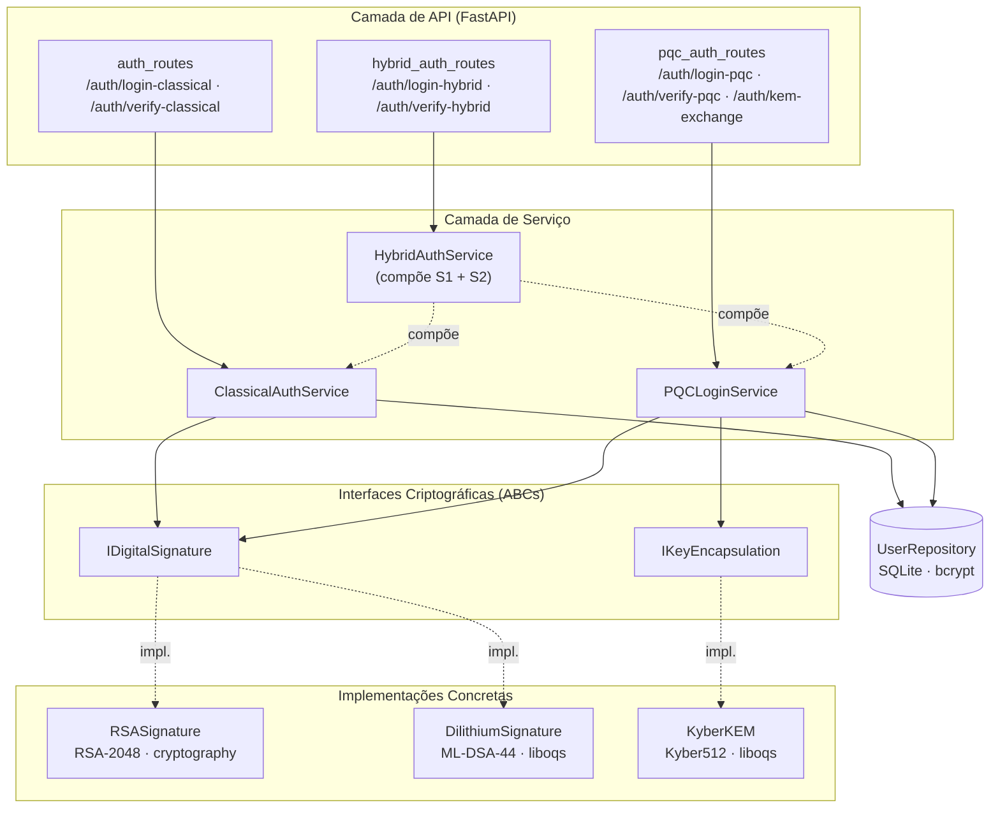

# 4. Metodologia

## 4.1 Caracterização da Pesquisa

Este trabalho caracteriza-se como uma pesquisa aplicada, de natureza quantitativa e com objetivo descritivo-comparativo. A abordagem adotada combina o desenvolvimento de um sistema funcional de autenticação web com a coleta sistemática de métricas de desempenho em condições controladas, permitindo comparações diretas entre algoritmos criptográficos clássicos e pós-quânticos.

A escolha por uma pesquisa experimental justifica-se pela natureza do problema investigado: avaliar o comportamento prático de algoritmos pós-quânticos requer mais do que microbenchmarks isolados, exigindo um cenário realista de uso em que as operações criptográficas estejam integradas ao fluxo completo de autenticação. Desse modo, a pesquisa não se limita a executar primitivas criptográficas em isolamento, mas as exercita dentro de uma aplicação que reflete o uso esperado em sistemas web reais — geração e verificação de tokens, troca de chaves de sessão e composição de modos híbridos de operação.

A natureza quantitativa decorre da coleta de métricas mensuráveis e reproduzíveis: latência em milissegundos, consumo de memória em bytes e tamanhos de payload em bytes. Já o caráter descritivo-comparativo manifesta-se na análise paralela das três abordagens implementadas, com o objetivo de identificar diferenças sistemáticas entre paradigmas criptográficos, e não de propor um novo algoritmo.

## 4.2 Arquitetura do Sistema

O sistema desenvolvido segue os princípios da Clean Architecture, organizando o código em camadas com responsabilidades bem definidas e dependências unidirecionais. A camada de interface (API) expõe os endpoints REST consumidos pelos clientes; a camada de serviço (Auth Service) implementa a lógica de autenticação; a camada de criptografia define contratos abstratos por meio de interfaces; e as implementações concretas dessas interfaces encapsulam o uso das bibliotecas criptográficas externas, conforme ilustrado na Figura 4.1.

Figura 4.1 — Organização em camadas do sistema de autenticação implementado.
Fonte: Elaborado pelo autor (2026).

A separação entre interface e implementação concentra-se em dois contratos abstratos. A interface `IDigitalSignature` define as operações comuns a qualquer algoritmo de assinatura digital — geração de par de chaves, assinatura de mensagem e verificação de assinatura — sem expor detalhes internos do algoritmo subjacente. De forma análoga, a interface `IKeyEncapsulation` define as operações de geração de chaves, encapsulamento e decapsulamento para mecanismos KEM. Essa abstração foi adotada como aplicação direta do princípio de inversão de dependência, segundo o qual módulos de alto nível não devem depender de módulos de baixo nível, mas sim de abstrações.

A escolha tem motivação metodológica clara: trocar um algoritmo — por exemplo, RSA-2048 por ML-DSA-44 — altera apenas a implementação concreta da interface, sem tocar nas camadas de serviço ou de API. Com isso, a lógica de autenticação (validação de credenciais, montagem de payload, codificação base64url e retorno HTTP) permanece idêntica nos três modos, e as diferenças de desempenho observadas tornam-se atribuíveis exclusivamente à primitiva criptográfica subjacente, e não a variações na lógica de controle ou na estrutura do token. É esse isolamento arquitetural que sustenta a validade interna dos benchmarks e torna metodologicamente lícita a comparação direta entre os números coletados para cada algoritmo.

A persistência dos usuários cadastrados é realizada em banco de dados SQLite, com armazenamento de senhas por meio do algoritmo bcrypt para hashing. Embora o gerenciamento de usuários não seja foco da avaliação experimental, sua presença é necessária para que o fluxo de autenticação corresponda a um cenário realista. A camada de banco foi mantida deliberadamente simples justamente para que não se torne uma fonte de variabilidade nos benchmarks.

## 4.3 Implementação dos Modos de Autenticação

Foram implementados três modos de autenticação que compartilham a mesma arquitetura (Seção 4.2) e o mesmo fluxo de requisição, diferindo apenas nos algoritmos criptográficos empregados e na forma de compô-los. Os três coexistem no mesmo sistema e podem ser exercitados de forma independente, o que viabiliza a comparação direta sem viés de plataforma ou ambiente. A Tabela 4.1 resume o stack de implementação comum aos três modos.

**Tabela 4.1** — Stack de implementação comum aos três modos de autenticação.

| Componente | Tecnologia / esquema | Versão |
|------------|----------------------|--------|
| Runtime | Python | 3.13 |
| Framework web | FastAPI | 0.135.1 |
| Assinatura clássica | PyJWT → cryptography (RS256, PKCS#1 v1.5) | — |
| Assinatura PQC | liboqs-python → liboqs (ML-DSA-44, FIPS 204) | 0.14.1 / 0.15.0 |
| Encapsulamento PQC | liboqs-python → liboqs (ML-KEM-512 / Kyber512, FIPS 203) | 0.14.1 / 0.15.0 |
| Persistência | SQLite + bcrypt | — |

Fonte: Elaborado pelo autor (2026).

### 4.3.1 Modo Clássico (RSA-2048 + JWT RS256)

O modo clássico é a linha de base de comparação; a justificativa da escolha de RSA-2048 e RS256 está na Seção 3.1. O par de chaves RSA é gerado uma única vez na inicialização do serviço e mantido em memória — decisão consistente com servidores de produção, em que o custo de geração é amortizado ao longo do processo. No login, após a validação de credenciais por bcrypt, o serviço monta o payload JWT (identificador do usuário, instantes de emissão e expiração) e o assina com a chave privada via PyJWT, que delega a operação à biblioteca `cryptography`. Na verificação, executada a cada requisição subsequente, o token é decodificado e sua assinatura conferida com a chave pública.

Registra-se uma distinção de implementação relevante para o Capítulo 5: o fluxo de serviço (`jwt_sign` / `jwt_verify`) usa RS256 com preenchimento PKCS#1 v1.5, enquanto as primitivas isoladas (`raw_rsa_sign` / `raw_rsa_verify`, Seção 4.5) usam RSA-PSS. Como o custo é dominado pela mesma exponenciação modular com a chave de 2048 bits, o esquema de preenchimento não altera materialmente a latência, e a medição permanece representativa do RS256.

### 4.3.2 Modo PQC Puro (ML-DSA-44 + Kyber512)

O modo pós-quântico substitui os algoritmos clássicos pelas contrapartes resistentes a ataques quânticos, mantendo o fluxo inalterado: assinatura por ML-DSA-44 (FIPS 204) e encapsulamento por ML-KEM-512 / Kyber512 (FIPS 203), ambos via liboqs 0.15.0, acessada a partir do binding `liboqs-python` 0.14.1.

O token PQC adota um formato próprio em base64url, análogo em estrutura ao JWT (cabeçalho, payload e assinatura separados por pontos), mas dimensionado para a assinatura de cerca de 2.420 bytes do ML-DSA-44. O formato próprio foi necessário porque o JWT, em sua especificação atual, ainda não registra algoritmos pós-quânticos como tipos de assinatura.

Além do fluxo de tokens, este modo expõe um endpoint dedicado de troca de chaves por Kyber512: o servidor gera um par de chaves KEM, recebe um ciphertext do cliente e executa o decapsulamento para derivar a chave simétrica compartilhada. O endpoint não integra o fluxo de autenticação por token, mas representa o caso de uso complementar de estabelecimento de canal de sessão pós-quântico, medido isoladamente na Seção 5.1.3.

### 4.3.3 Modo Híbrido

O modo híbrido executa o algoritmo clássico e o pós-quântico em cada autenticação. A implementação não adota a "dupla assinatura" (um único token com duas assinaturas concatenadas), e sim a estratégia de "tokens duplos": o servidor responde a cada login com dois tokens independentes — um JWT RS256 e um token ML-DSA-44 — entregues juntos ao cliente. Essa estratégia permite verificação independente e suporta migração gradual, em que clientes em estágios distintos de adoção usam apenas um dos tokens; a motivação completa está na Seção 2.6.

O serviço híbrido compõe os serviços clássico e pós-quântico por injeção de dependência, sem reescrever a lógica criptográfica. A latência total equivale, portanto, à soma das latências individuais mais o custo de orquestração — que se mantém baixo, pois nenhuma operação adicional é introduzida além das já presentes em cada modo isolado.

## 4.4 Protocolo de Benchmarking

A coleta de medições de desempenho seguiu um protocolo único para todas as operações avaliadas, projetado para garantir comparabilidade entre algoritmos e reprodutibilidade entre execuções. O protocolo é composto por quatro elementos principais: a configuração de execução, o instrumento de medição de tempo, o instrumento de medição de memória e o procedimento de validação de reprodutibilidade.

### 4.4.1 Configuração Experimental

Cada operação foi avaliada em uma sequência de 100 iterações de medição por execução, precedidas por 10 iterações adicionais de aquecimento (warmup) cujos resultados são descartados. O protocolo completo foi repetido em três execuções independentes — conforme detalhado na Seção 4.4.4 —, totalizando 300 observações por operação e 6.000 amostras brutas no conjunto experimental, considerando as 20 operações listadas na Seção 4.5. O período de warmup foi adotado para mitigar efeitos transitórios de inicialização — como a carga preguiçosa de bibliotecas, a alocação de buffers internos e a otimização de caminhos de execução pelo interpretador Python — que tendem a inflacionar artificialmente a latência das primeiras execuções e que não correspondem ao regime permanente observado em sistemas em produção.

O instrumento de medição de tempo foi a função `time.perf_counter()` da biblioteca padrão do Python, escolhida por oferecer a maior resolução temporal disponível na plataforma utilizada e por ser monotônica, isto é, garantida contra ajustes de relógio do sistema durante a medição. A janela de timing foi posicionada para envolver exclusivamente a operação criptográfica em si, excluindo deliberadamente a serialização HTTP, o acesso ao banco de dados, a verificação de credenciais por bcrypt e demais operações que não fazem parte do escopo da avaliação. Esse isolamento foi obtido aplicando o timing dentro da camada de serviço, no entorno imediato da chamada à interface criptográfica.

A partir das 100 amostras coletadas para cada operação, foram calculadas as estatísticas descritivas de média, mediana, desvio padrão, percentil 95 e percentil 99. A média fornece uma visão central tradicional, enquanto a mediana é menos sensível a outliers, frequentes em medições de latência sub-milissegundo. Os percentis P95 e P99 foram incluídos por serem métricas amplamente adotadas em engenharia de desempenho de sistemas web, refletindo o comportamento da cauda da distribuição — particularmente relevante para serviços nos quais a experiência do usuário depende não apenas do caso médio, mas também dos piores casos esporádicos.

### 4.4.2 Medição de Memória

A medição de consumo de memória foi realizada com o módulo `tracemalloc` da biblioteca padrão do Python, que rastreia as alocações realizadas pelo interpretador e permite obter o pico de consumo durante uma janela arbitrária de execução. A métrica adotada foi o pico de alocação (peak bytes) registrado entre o início e o término da operação criptográfica.

Uma decisão metodológica relevante foi separar a medição de tempo da medição de memória em passes independentes. Quando o `tracemalloc` está ativo, ele introduz um pequeno overhead em cada alocação realizada pelo interpretador, o que distorce as medições de latência sub-milissegundo. Para evitar essa interferência, o protocolo executa primeiro um pass dedicado à coleta de tempos, com o `tracemalloc` desativado, e em seguida um pass dedicado à coleta de memória, com timing desativado. Cada métrica é obtida nas condições em que ela pode ser medida com maior fidelidade.

O pass de memória utilizou um número reduzido de iterações por operação, suficiente para obter o pico de alocação sem introduzir ruído por instabilidade do garbage collector. Esse pico é uma métrica conservadora, no sentido de que estima o pior caso de pressão sobre a memória durante a execução de uma operação isolada — informação útil para dimensionamento de recursos em servidores que processam múltiplas autenticações concorrentes.

### 4.4.3 Ambiente de Execução

Todos os experimentos foram executados em um único ambiente de hardware e software, descrito na Tabela 4.2. A uniformidade do ambiente é necessária para que as comparações entre algoritmos não sejam contaminadas por variações de plataforma; em contrapartida, as conclusões derivadas dos números absolutos coletados são específicas para esse ambiente, e a generalização para outras plataformas exige cautela e, idealmente, replicação experimental — limitação que será discutida no Capítulo 6.

**Tabela 4.2** — Componentes do ambiente experimental.

| Componente | Versão / Configuração |
|------------|----------------------|
| Arquitetura de hardware | Apple Silicon (ARM64) |
| Sistema operacional | macOS 15 (Darwin 25) |
| Python | 3.13 |
| liboqs (núcleo C) | 0.15.0 |
| liboqs-python (binding) | 0.14.1 |
| PyJWT | 2.12.1 |
| cryptography | 46.0.5 |
| bcrypt | 5.0.0 |

Fonte: Elaborado pelo autor (2026).

### 4.4.4 Validação de Reprodutibilidade

Para verificar a estabilidade dos resultados ao longo do tempo e em condições levemente diferentes de execução, todo o protocolo de medição foi repetido em três execuções independentes. As execuções foram realizadas em momentos distintos, com reinicialização do processo Python e um intervalo de resfriamento de trinta segundos entre elas — este último para mitigar efeitos de *thermal throttling* no processador —, garantindo que efeitos como acúmulo de cache, fragmentação de memória ou variações de carga térmica do hardware fossem amostrados.

A métrica de validação de reprodutibilidade utilizada foi o coeficiente de variação (CV), definido como o quociente entre o desvio padrão e a média de uma operação considerando suas três execuções. O CV foi escolhido por ser uma métrica adimensional que normaliza a dispersão pela escala da grandeza medida, permitindo comparar diretamente a estabilidade de operações com latências em ordens de magnitude diferentes. Adotou-se, como critério operacional deste trabalho, que operações com CV inferior a 10% sejam consideradas altamente reprodutíveis — patamar prático abaixo do qual a dispersão entre execuções é pequena o suficiente para não comprometer comparações quantitativas; variações superiores a 10% são tratadas como indício de interferência de variáveis não controladas e sinalizam necessidade de investigação adicional.

## 4.5 Operações Avaliadas

O conjunto de operações avaliadas foi organizado em duas categorias complementares, denominadas neste trabalho como camada de serviço e camada bruta. A camada de serviço corresponde à operação criptográfica integrada ao fluxo completo de autenticação — incluindo, por exemplo, a codificação base64url de um token JWT após sua assinatura. Já a camada bruta corresponde à primitiva criptográfica isolada, sem o overhead de codificação, formatação ou montagem de payload. A medição em ambas as camadas permite distinguir o custo intrínseco do algoritmo do custo agregado pelo formato de token utilizado, informação relevante para identificar oportunidades de otimização específicas.

**Tabela 4.3** — Operações criptográficas avaliadas no protocolo experimental.

| Operação | Algoritmo | Camada | Contexto |
|----------|-----------|--------|----------|
| `jwt_sign` | RSA-2048 / RS256 | Serviço | Geração de token JWT no login clássico |
| `jwt_verify` | RSA-2048 / RS256 | Serviço | Verificação de token JWT em requisições autenticadas |
| `pqc_sign` | ML-DSA-44 | Serviço | Geração de token PQC no login pós-quântico |
| `pqc_verify` | ML-DSA-44 | Serviço | Verificação de token PQC |
| `kem_keygen` | Kyber512 | Serviço | Geração de par de chaves KEM no servidor |
| `kem_encapsulate` | Kyber512 | Serviço | Encapsulamento da chave simétrica pelo cliente |
| `kem_decapsulate` | Kyber512 | Serviço | Decapsulamento da chave simétrica pelo servidor |
| `hybrid_sign_classical` | RS256 | Serviço | Componente clássico (RS256) na geração de tokens duplos no login híbrido |
| `hybrid_sign_pqc` | ML-DSA-44 | Serviço | Componente PQC (ML-DSA-44) na geração de tokens duplos no login híbrido |
| `hybrid_verify_classical` | RS256 | Serviço | Componente clássico (RS256) na verificação de tokens duplos |
| `hybrid_verify_pqc` | ML-DSA-44 | Serviço | Componente PQC (ML-DSA-44) na verificação de tokens duplos |
| `raw_rsa_keygen` | RSA-2048 | Bruta | Geração de chave RSA pura, sem JWT |
| `raw_rsa_sign` | RSA-2048 | Bruta | Assinatura RSA pura, sem encoding JWT |
| `raw_rsa_verify` | RSA-2048 | Bruta | Verificação RSA pura |
| `raw_mldsa_keygen` | ML-DSA-44 | Bruta | Geração de chave ML-DSA pura |
| `raw_mldsa_sign` | ML-DSA-44 | Bruta | Assinatura ML-DSA pura, sem token encoding |
| `raw_mldsa_verify` | ML-DSA-44 | Bruta | Verificação ML-DSA pura |
| `raw_kyber_keygen` | Kyber512 | Bruta | Geração de chave Kyber pura |
| `raw_kyber_encapsulate` | Kyber512 | Bruta | Encapsulamento Kyber puro |
| `raw_kyber_decapsulate` | Kyber512 | Bruta | Decapsulamento Kyber puro |

Fonte: Elaborado pelo autor (2026).

A Tabela 4.3 lista as 20 operações que compõem o conjunto experimental, agrupadas por modo de autenticação. As operações marcadas como camada de serviço refletem o cenário de uso real em uma API web, ao passo que as operações marcadas como camada bruta servem como referência inferior do custo computacional do algoritmo.

Em conformidade com o compromisso de reprodutibilidade declarado neste trabalho, o código-fonte completo do sistema, o protocolo de benchmarking e os dados brutos de medição encontram-se publicamente disponíveis no repositório do projeto, em https://github.com/gabrielaragao01/tcc-pqc-auth.

## 4.6 Ameaças à Validade

Trabalhos experimentais em engenharia de software, especialmente os de natureza comparativa, estão sujeitos a um conjunto de ameaças à validade dos resultados que devem ser explicitadas para que o leitor possa interpretar os achados com o devido grau de confiança e identificar o escopo de generalização adequado. Esta seção sistematiza as principais ameaças identificadas no protocolo descrito, agrupadas em três categorias clássicas — validade interna, validade externa e validade de construto — e descreve as decisões metodológicas adotadas para mitigá-las.

### 4.6.1 Validade Interna

A validade interna diz respeito a atribuir as diferenças observadas aos algoritmos, e não a fatores incidentais. A principal ameaça é o ruído de medição (processos concorrentes, escalonador do SO, coletor de lixo do Python), mitigado por ambiente com processos de fundo minimizados, dez iterações de warmup por bloco e monitoramento do coeficiente de variação inter-execução (Seção 4.4.4). Uma segunda ameaça é o acoplamento entre as medições de tempo e de memória, dado o overhead do `tracemalloc`; ela é mitigada pela separação em passes independentes. Por fim, a uniformidade do fluxo entre os três modos — garantida pela arquitetura em camadas (Seção 4.2) — é o que sustenta a atribuição causal das diferenças à primitiva criptográfica.

### 4.6.2 Validade Externa

A generalização dos resultados é limitada por quatro fatores: (i) a arquitetura ARM64 (Apple Silicon), cujas instruções SIMD favorecem algoritmos lattice-based; (ii) a linguagem Python, que adiciona overhead de interpretação ausente em servidores em C, Rust ou Go, ainda que as primitivas executem em código nativo; (iii) a ausência de uma camada TLS over-the-wire, isolando o custo de autenticação do handshake de transporte; e (iv) o regime single-threaded, sem carga concorrente. Esses limites são retomados, em síntese, no Capítulo 6.

### 4.6.3 Validade de Construto

Mede-se a latência e a memória de primitivas integradas a um fluxo de autenticação isolado para afirmar algo sobre o custo prático de adoção em sistemas web. Como a latência de uma primitiva isolada não equivale à latência percebida pelo usuário final em um sistema distribuído (rede, DNS, TLS, fila de requisições, proxy reverso), os resultados devem ser lidos como referência inferior do custo agregado. Para reduzir essa distância, o protocolo separa explicitamente camada bruta e camada de serviço (Seção 4.5), tornando transparente quais frações do tempo decorrem do algoritmo e quais decorrem da aplicação ao seu redor.
