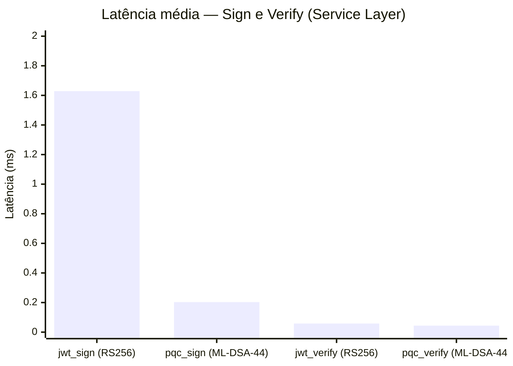

# 5. Resultados e Discussão

Este capítulo apresenta e analisa os resultados obtidos a partir do protocolo de benchmarking descrito no Capítulo 4. As medições foram organizadas em sete dimensões de análise, partindo das latências individuais de cada operação criptográfica, passando pela comparação entre o nível de serviço e a primitiva criptográfica isolada, e culminando na avaliação do modo híbrido. Todos os valores reportados nas Tabelas 5.1 a 5.6 correspondem a estatísticas pooled calculadas sobre o conjunto agregado de 300 amostras por operação — três execuções independentes de 100 iterações cada, após dez iterações de aquecimento descartadas —, totalizando 6.000 amostras no conjunto experimental completo. A Tabela 5.7, dedicada à reprodutibilidade, reporta separadamente o coeficiente de variação inter-run, calculado sobre as médias por execução. Os arquivos brutos de medição encontram-se em `results/runs/run_{1,2,3}/raw_samples.csv` e a base consolidada em `results/multi_run/combined_samples.csv`.

A discussão articulada ao longo das próximas seções não se limita à descrição numérica dos resultados, mas busca interpretar cada diferença observada à luz de suas causas algorítmicas e de suas implicações para sistemas reais de autenticação web. Quando pertinente, os números obtidos são confrontados com as especificações oficiais do NIST e com a literatura recente em desempenho de criptografia pós-quântica.

## 5.1 Latência das Operações Criptográficas

A latência das operações criptográficas constitui a métrica central deste trabalho, pois determina diretamente o impacto de cada algoritmo sobre o tempo de resposta de um sistema de autenticação. As subseções a seguir apresentam os resultados em três blocos: geração de chaves, assinatura e verificação de tokens e operações de encapsulamento de chave (KEM).

### 5.1.1 Geração de Chaves

A geração de chaves ocorre em momentos distintos do ciclo de vida de cada algoritmo: no caso do RSA-2048, é tipicamente executada uma única vez durante a inicialização do serviço, ao passo que, para o ML-DSA-44 e o Kyber512, sua execução pode ser frequente, dado o custo computacional reduzido. A Tabela 5.1 sintetiza as latências médias e medianas medidas no nível de primitiva criptográfica.

Tabela 5.1 — Latência da geração de pares de chaves no nível de primitiva (raw crypto).

| Algoritmo  | Operação                | Média (ms) | Mediana (ms) | Desv. padrão (ms) | P95 (ms)  |
|------------|-------------------------|-----------:|-------------:|------------------:|----------:|
| RSA-2048   | `raw_rsa_keygen`        |    108,333 |       97,283 |            61,565 |   224,764 |
| ML-DSA-44  | `raw_mldsa_keygen`      |      0,049 |        0,047 |             0,009 |     0,053 |
| Kyber512   | `raw_kyber_keygen`      |      0,018 |        0,017 |             0,007 |     0,022 |

Fonte: Elaborado pelo autor (2026).

Os dados revelam uma diferença de aproximadamente 2.206 vezes entre o RSA-2048 e o ML-DSA-44 na geração de chaves, e de cerca de 6.018 vezes entre o RSA-2048 e o Kyber512. Essa disparidade decorre da própria natureza matemática dos algoritmos. A geração de chaves RSA exige a obtenção de dois números primos de grande magnitude, processo que envolve testes de primalidade probabilísticos (como Miller-Rabin) cujo custo cresce de forma superlinear com o tamanho da chave. Os algoritmos baseados em reticulados, em contraste, geram chaves a partir de operações matriciais sobre polinômios em anéis cíclicos, com complexidade dominada por transformadas teórico-numéricas (NTT) executadas em tempo $O(n \log n)$ (NIST, 2024a, 2024b).

A elevada variância intra-amostra observada no `raw_rsa_keygen` (desvio padrão pooled de 61,57 ms sobre as 300 amostras, com P95 atingindo 224,76 ms) reflete justamente a natureza probabilística dos testes de primalidade: ocasionalmente, vários candidatos são rejeitados antes que um número primo seja confirmado, alongando o tempo total. A grand mean de 108,33 ms ao longo das três execuções, em contraste, mostrou-se altamente reprodutível, com coeficiente de variação inter-run de apenas 3,65% — isto é, a distribuição em si é dispersa, mas a posição central da distribuição é estável de uma execução para outra. Essa diferença entre dispersão intra-amostra e estabilidade inter-run é discutida em maior profundidade na Seção 5.5.

Embora o RSA keygen ocorra apenas na inicialização do serviço — sendo, portanto, amortizado durante todo o tempo de execução do processo — a diferença observada tem implicações práticas em arquiteturas que demandam rotação frequente de chaves, em sistemas baseados em chaves efêmeras por sessão e em ambientes de orquestração de contêineres com inicialização recorrente, nos quais o custo de inicialização incide sobre cada novo contêiner instanciado.

### 5.1.2 Operações de Assinatura e Verificação

As operações de assinatura e verificação são as que mais frequentemente ocorrem em sistemas de autenticação baseados em token, sendo executadas a cada login e a cada requisição autenticada, respectivamente. A Tabela 5.2 apresenta os resultados consolidados no nível de serviço, isto é, considerando a operação criptográfica conforme integrada ao fluxo real de autenticação.

Tabela 5.2 — Latência das operações de assinatura e verificação no nível de serviço.

| Operação        | Algoritmo  | Média (ms) | Mediana (ms) | Desv. padrão (ms) | P95 (ms) |
|-----------------|------------|-----------:|-------------:|------------------:|---------:|
| `jwt_sign`      | RS256      |      1,629 |        1,535 |             0,427 |    2,264 |
| `pqc_sign`      | ML-DSA-44  |      0,203 |        0,180 |             0,144 |    0,324 |
| `jwt_verify`    | RS256      |      0,058 |        0,054 |             0,022 |    0,071 |
| `pqc_verify`    | ML-DSA-44  |      0,044 |        0,044 |             0,002 |    0,046 |

Fonte: Elaborado pelo autor (2026).

Verifica-se que o ML-DSA-44 foi aproximadamente 8,0 vezes mais rápido que o RS256 na operação de assinatura e cerca de 1,3 vezes mais rápido na verificação. O resultado mais relevante é o da assinatura, pois é a operação de maior custo no fluxo clássico e a que ocorre no caminho crítico do login. Esse comportamento é coerente com a literatura: a assinatura RSA emprega exponenciação modular com expoente privado de grande magnitude, ao passo que a assinatura ML-DSA-44 consiste em operações sobre matrizes de polinômios de coeficientes pequenos, sustentadas por NTT eficientes (Bai et al., 2021).

A operação de verificação, em contraste, apresenta diferença mais modesta. Esse achado é igualmente esperado: a verificação RSA utiliza a chave pública com expoente de Fermat $e = 65.537$, valor binariamente esparso que torna a exponenciação modular intrinsecamente rápida — característica histórica do RS256 e razão pela qual o algoritmo permaneceu viável em sistemas web por décadas. Já o ML-DSA-44 não exibe assimetria pronunciada entre assinatura e verificação, dado que ambas as operações recaem sobre o mesmo aparato algébrico de reticulados.

A Figura 5.1 sintetiza visualmente a comparação das latências de assinatura e verificação entre os dois algoritmos.

Figura 5.1 — Latência média das operações de assinatura e verificação na camada de serviço. Valores em milissegundos (grand mean sobre 300 amostras pooled: 100 iterações por execução em três execuções independentes).
Fonte: Elaborado pelo autor (2026).

A interpretação prática destes resultados, do ponto de vista de uma aplicação web, é direta: substituir o RS256 pelo ML-DSA-44 reduz o tempo de assinatura em mais de 1,4 ms por login. Em um cenário de mil logins simultâneos, isso representa, agregadamente, cerca de 1,4 segundo de processamento criptográfico economizado, considerando execução sequencial das operações criptográficas, sem paralelismo entre workers. Em servidores reais com I/O assíncrono e múltiplos workers, o efeito não se manifesta como redução do tempo total de resposta de uma única requisição — esse permanece dominado pela latência de rede e por outras camadas —, mas sim como aumento da vazão (requisições por unidade de tempo) para uma mesma alocação de recursos de CPU. Essa observação contradiz o senso comum de que algoritmos pós-quânticos seriam computacionalmente mais lentos que seus equivalentes clássicos — um equívoco frequentemente associado ao tamanho das chaves e tokens, e não ao custo das operações criptográficas em si, dimensão tratada na Seção 5.4.

### 5.1.3 Operações KEM

O mecanismo de encapsulamento de chave Kyber512 foi avaliado em suas três operações fundamentais: geração de par de chaves, encapsulamento (executado pelo emissor) e decapsulamento (executado pelo receptor). A Tabela 5.3 consolida os resultados.

Tabela 5.3 — Latência das operações Kyber512 no nível de serviço.

| Operação            | Média (ms) | Mediana (ms) | Desv. padrão (ms) | P95 (ms) |
|---------------------|-----------:|-------------:|------------------:|---------:|
| `kem_keygen`        |      0,017 |        0,017 |             0,001 |    0,017 |
| `kem_encapsulate`   |      0,019 |        0,019 |             0,002 |    0,020 |
| `kem_decapsulate`   |      0,017 |        0,016 |             0,001 |    0,017 |

Fonte: Elaborado pelo autor (2026).

Todas as três operações foram executadas em latências sub-milissegundo, com tempo agregado de aproximadamente 0,053 ms para um round-trip completo de troca de chave. Esse valor é desprezível em qualquer contexto realista de comunicação em rede, no qual a latência típica entre cliente e servidor situa-se na ordem de dezenas a centenas de milissegundos. Em termos relativos, o custo computacional de um handshake Kyber512 representa menos de 0,1% da latência de rede esperada em uma chamada HTTPS típica, o que sustenta a viabilidade técnica de adoção do mecanismo em protocolos de autenticação web sem prejuízo perceptível ao tempo de resposta.

Adicionalmente, observa-se que o desvio padrão das três operações é significativamente baixo (da ordem de 0,001 a 0,002 ms, conforme a Tabela 5.3), o que indica que as operações Kyber512 são altamente estáveis em sua execução. A ausência de operações condicionais dependentes de dados nos algoritmos baseados em reticulados — propriedade essencial para resistência a ataques de canal lateral por temporização — contribui para essa baixa variabilidade.

## 5.2 Comparação Service Layer vs Raw Crypto

Uma das contribuições metodológicas deste trabalho é a distinção sistemática entre dois níveis de medição: a camada de serviço, que reflete o custo efetivo da operação no contexto do fluxo de autenticação, e a primitiva criptográfica isolada, que mede a operação algorítmica sem o envoltório adicional do sistema. Essa distinção é relevante porque, na maioria da literatura comparativa, apenas um dos dois níveis é reportado, dificultando a transposição dos resultados para sistemas reais. A Tabela 5.4 apresenta as principais comparações.

Tabela 5.4 — Comparação entre o nível de serviço e a primitiva criptográfica isolada.

| Operação                 | Algoritmo  | Service (ms) | Raw (ms)  | Sobrecusto (ms) | Sobrecusto (%) |
|--------------------------|------------|-------------:|----------:|----------------:|---------------:|
| Sign — token             | RS256      |        1,629 |    89,323 |            —    |             —  |
| Sign                     | ML-DSA-44  |        0,203 |     0,106 |           0,097 |          91,5  |
| Verify                   | RS256      |        0,058 |     0,113 |            —    |             —  |
| Verify                   | ML-DSA-44  |        0,044 |     0,044 |           0,000 |           0,0  |

Fonte: Elaborado pelo autor (2026).

A comparação entre o `jwt_sign` (1,629 ms) e o `raw_rsa_sign` (89,323 ms) merece atenção especial. À primeira vista, a diferença sugeriria que a camada de serviço seria 54 vezes mais rápida que a primitiva — interpretação evidentemente equivocada. A explicação reside na metodologia: a primitiva raw mede o custo total de uma operação RSA "do zero", incluindo a desserialização da chave privada DER (`load_der_private_key`) a cada iteração — processo que domina o tempo medido, da ordem de 88 ms por chamada no ambiente experimental, ante menos de 1 ms da operação de assinatura RSA propriamente dita. No nível de serviço, a chave RSA é parseada uma única vez na inicialização do `ClassicalAuthService` e mantida em memória como objeto Python pré-carregado, eliminando esse custo recorrente. A medição em camada de serviço, portanto, reflete adequadamente o regime permanente de um servidor de produção, no qual chaves não são reparseadas a cada requisição. Cabe notar que a primitiva `raw_rsa_*` utiliza o preenchimento RSA-PSS, ao passo que o `jwt_sign` adota o RS256/PKCS#1 v1.5; conforme registrado na Seção 4.3.1, essa diferença de preenchimento não afeta materialmente o custo da assinatura e, portanto, não contribui para a disparidade observada, integralmente explicada pela reserialização da chave. Já na verificação, observa-se o padrão inverso — a primitiva isolada (0,113 ms, RSA-PSS via `cryptography`) é mais lenta que a camada de serviço (0,058 ms, PKCS#1 v1.5 via PyJWT); nessa escala de dezenas de microssegundos, a diferença reflete os caminhos de código e o esquema de preenchimento distintos das duas bibliotecas, e não um custo intrínseco da verificação, permanecendo ambos os valores desprezíveis em termos absolutos.

Para o ML-DSA-44, o sobrecusto da camada de serviço sobre a primitiva é de cerca de 0,097 ms na assinatura, atribuível à codificação base64url do token e à composição do payload. Esse acréscimo é proporcionalmente expressivo (91,5%) por se sobrepor a uma operação criptográfica intrinsecamente rápida, mas é absoluto pequeno em valor (97 microssegundos), sem impacto perceptível na latência total do login. Já a operação de verificação ML-DSA-44 não apresenta sobrecusto mensurável entre os dois níveis, dado que o decode base64url é uma operação extremamente eficiente quando comparada à própria verificação criptográfica.

Esta análise permite uma constatação importante para o domínio de aplicação: o overhead de codificação e empacotamento de tokens é desprezível em comparação ao custo das operações criptográficas, de modo que os ganhos de desempenho do ML-DSA-44 sobre o RS256 não são erodidos pela camada de serialização do token. A escolha do algoritmo é, portanto, o principal determinante do tempo de resposta em autenticação por token.

## 5.3 Uso de Memória

O consumo de memória foi medido por meio do módulo `tracemalloc` da biblioteca padrão Python, em passes separados das medições de latência conforme descrito no Capítulo 4, com o objetivo de evitar interferências da instrumentação de memória sobre o relógio de alta resolução. A Tabela 5.5 apresenta o pico de alocação por operação.

Tabela 5.5 — Pico de alocação de memória por operação (tracemalloc, peak bytes).

| Operação                 | Algoritmo  | Camada  | Pico médio (bytes) |
|--------------------------|------------|---------|-------------------:|
| `jwt_sign`               | RS256      | Serviço |              3.448 |
| `pqc_sign`               | ML-DSA-44  | Serviço |             10.622 |
| `jwt_verify`             | RS256      | Serviço |              2.840 |
| `pqc_verify`             | ML-DSA-44  | Serviço |             13.497 |
| `kem_keygen`             | Kyber512   | Serviço |              8.960 |
| `kem_encapsulate`        | Kyber512   | Serviço |              8.960 |
| `kem_decapsulate`        | Kyber512   | Serviço |              8.960 |
| `raw_rsa_keygen`         | RSA-2048   | Bruta   |              1.933 |
| `raw_rsa_sign`           | RSA-2048   | Bruta   |                732 |
| `raw_mldsa_sign`         | ML-DSA-44  | Bruta   |              9.294 |

Fonte: Elaborado pelo autor (2026).

Observa-se que as operações pós-quânticas alocam, em média, três a cinco vezes mais memória que suas equivalentes clássicas. Esse padrão é consistente com o tamanho das estruturas algébricas manipuladas: o ML-DSA-44 opera sobre matrizes de polinômios cujos coeficientes ocupam mais memória do que os números inteiros utilizados pelo RSA. Nota-se ainda que, no ML-DSA-44, a verificação apresenta pico de alocação ligeiramente superior ao da assinatura (13.497 contra 10.622 bytes), refletindo o fato de que ambas as operações sobre reticulados manipulam estruturas algébricas de tamanho comparável — ao contrário do RSA, no qual a verificação é substancialmente mais leve que a assinatura. No entanto, em termos absolutos, todos os valores permanecem na ordem de poucos quilobytes por operação, o que torna o consumo de memória uma preocupação secundária em sistemas web modernos, em que servidores comumente dispõem de gigabytes de memória disponível.

Vale observar que os valores reportados refletem o pico de alocação registrado durante a operação criptográfica, e não o consumo permanente de memória do processo. A maior parte da memória alocada é liberada imediatamente após a operação, seja por desreferenciação automática pelo coletor de lixo do Python, seja por desalocação explícita pelos contextos `with oqs.KeyEncapsulation(...)` empregados na implementação. O efeito sobre o uso de memória residual do processo, portanto, é negligível.

A relevância prática desse resultado situa-se em cenários de altíssima concorrência. Em um servidor processando dez mil requisições simultâneas com modo PQC puro, o pico de memória adicional alocado pelas operações criptográficas seria da ordem de cem megabytes em relação ao modo clássico — valor significativo apenas em ambientes com restrição severa de memória, como dispositivos embarcados ou contêineres com limites estritos. Para servidores web convencionais, esse consumo é absorvido sem impacto.

Uma implicação adicional, relevante para o planejamento de capacidade, é que a homogeneidade do consumo de memória entre algoritmos no nível de serviço — onde o overhead do framework FastAPI e da gestão de objetos Python domina sobre o custo intrínseco da primitiva — significa que o dimensionamento de memória por instância concorrente é essencialmente independente do algoritmo escolhido. Em outras palavras, a decisão entre adotar RS256, ML-DSA-44 ou o modo híbrido pode ser tomada com base em critérios de segurança, latência e tamanho de payload, sem que o consumo de memória precise figurar como variável determinante do dimensionamento de servidores.

## 5.4 Tamanho de Tokens e Chaves

O tamanho dos elementos transmitidos pela rede revela o trade-off central da migração para criptografia pós-quântica e constitui o aspecto mais desafiador da adoção prática do ML-DSA-44 em sistemas web. A Tabela 5.6 sintetiza os tamanhos observados.

Tabela 5.6 — Tamanho dos elementos transmitidos via rede.

| Elemento                       | Tamanho (bytes) | Razão (PQC/Clássico) |
|--------------------------------|----------------:|---------------------:|
| Token JWT RS256 (completo)     |             451 |                  —   |
| Token ML-DSA-44 (completo)     |           3.342 |                7,4×  |
| Chave pública RSA-2048         |             294 |                  —   |
| Chave pública ML-DSA-44        |           1.312 |                4,5×  |
| Chave pública Kyber512         |             800 |                2,7×  |
| Assinatura RSA-2048 (raw)      |             256 |                  —   |
| Assinatura ML-DSA-44 (raw)     |           2.420 |                9,5×  |
| Ciphertext Kyber512            |             768 |                  —   |

Fonte: Elaborado pelo autor (2026).

O token completo do modo PQC puro é cerca de 7,4 vezes maior que o equivalente clássico (3.342 bytes contra 451 bytes), diferença atribuível em sua quase totalidade à própria assinatura ML-DSA-44, que ocupa 2.420 bytes em representação binária e cerca de 3.227 bytes após codificação base64url. Esse aumento do tamanho do token tem implicações diretas sobre três aspectos operacionais.

O primeiro é o consumo de banda. Em um cenário de um milhão de requisições autenticadas por dia — escala típica de aplicações de médio porte — o overhead diário de transmissão do token PQC sobre o equivalente clássico é da ordem de 2,9 GB. Embora absorvível pela maioria dos provedores de infraestrutura, o custo adicional é mensurável em termos de tarifação de tráfego e de utilização de CDN.

O segundo aspecto é o impacto sobre cabeçalhos HTTP. O cabeçalho `Authorization: Bearer <token>` é transmitido em toda requisição autenticada. O tamanho excedente do token PQC pode aproximar-se ou ultrapassar limites configurados em proxies reversos, balanceadores de carga e gateways de API, exigindo ajustes de configuração em pilhas tradicionalmente dimensionadas para tokens JWT clássicos.

O terceiro aspecto refere-se a fragmentação de pacotes em redes de baixa MTU. O tamanho da assinatura ML-DSA-44 isolada (2.420 bytes) excede o limite de 1.500 bytes da MTU padrão Ethernet, podendo provocar fragmentação no nível de IP em redes que não suportam Path MTU Discovery, com efeito negativo sobre a latência de rede. Esse fenômeno, embora raro em redes corporativas modernas, é particularmente relevante em redes móveis e em conexões via VPN.

A análise consolidada deste trade-off é que o principal obstáculo à adoção do ML-DSA-44 em autenticação web não reside no custo computacional — que, conforme demonstrado nas seções anteriores, é favorável ao algoritmo pós-quântico — mas sim no custo de transmissão. Esse achado contradiz a percepção corrente de que a criptografia pós-quântica seria computacionalmente proibitiva e desloca o foco da discussão para o redimensionamento de infraestrutura de rede.

## 5.5 Reprodutibilidade e Validação Estatística

A reprodutibilidade dos resultados foi avaliada por meio de três execuções independentes do protocolo de benchmarking, com intervalo de resfriamento de trinta segundos entre execuções para mitigar efeitos de thermal throttling no processador. O coeficiente de variação inter-run (CV%) foi adotado como métrica de estabilidade, conforme definido no Capítulo 4. A Tabela 5.7 apresenta os resultados consolidados.

Tabela 5.7 — Coeficiente de variação inter-run das operações avaliadas.

| Operação                  | Algoritmo  | Grand mean (ms) | CV inter-run (%) | Classificação        |
|---------------------------|------------|----------------:|-----------------:|----------------------|
| `jwt_sign`                | RS256      |           1,629 |            4,42  | Excelente            |
| `jwt_verify`              | RS256      |           0,058 |            9,01  | Aceitável            |
| `pqc_sign`                | ML-DSA-44  |           0,203 |           12,41  | Marginal (ver nota)  |
| `pqc_verify`              | ML-DSA-44  |           0,044 |            1,34  | Excelente            |
| `kem_keygen`              | Kyber512   |           0,017 |            0,33  | Excelente            |
| `kem_encapsulate`         | Kyber512   |           0,019 |            0,98  | Excelente            |
| `kem_decapsulate`         | Kyber512   |           0,017 |            0,90  | Excelente            |
| `raw_rsa_keygen`          | RSA-2048   |         108,333 |            3,65  | Excelente            |
| `raw_rsa_sign`            | RSA-2048   |          89,323 |            0,96  | Excelente            |
| `raw_rsa_verify`          | RSA-2048   |           0,113 |            2,15  | Excelente            |
| `raw_mldsa_keygen`        | ML-DSA-44  |           0,049 |            5,48  | Aceitável            |
| `raw_mldsa_sign`          | ML-DSA-44  |           0,106 |            4,63  | Excelente            |
| `raw_mldsa_verify`        | ML-DSA-44  |           0,044 |            1,60  | Excelente            |

Fonte: Elaborado pelo autor (2026).

Dos vinte indicadores avaliados (incluindo as quatro operações híbridas e as três operações Kyber de camada bruta — `raw_kyber_keygen`, `raw_kyber_encapsulate` e `raw_kyber_decapsulate` —, todas reportadas em `results/multi_run/inter_run_stats.csv` e omitidas da tabela acima por brevidade), dezenove apresentaram coeficiente de variação inferior a 10%, o que os classifica como reprodutíveis segundo o critério adotado. Quinze deles ficaram abaixo de 5%, indicando reprodutibilidade excelente. A única exceção foi a operação `pqc_sign` na camada de serviço, com CV de 12,41%.

Essa exceção merece análise específica. A mediana de `pqc_sign` foi estável entre execuções (0,182 ms na grand median, com variação de apenas 0,005 ms entre runs individuais), o que confirma que a variabilidade inter-run encontra-se na cauda da distribuição, não no regime permanente. A causa provável é a sensibilidade de operações sub-milissegundo a outliers introduzidos por pausas do coletor de lixo do Python e por escalonamento ocasional de outros processos do sistema, fenômenos que afetam desproporcionalmente operações cujo tempo médio é da ordem de centenas de microssegundos. Análise complementar indicou que três a cinco amostras por execução, dentre as cem coletadas, concentram a totalidade da variabilidade observada — comportamento documentado na literatura de benchmarking de operações criptográficas rápidas (Paquin et al., 2020).

A constatação prática é que os resultados são suficientemente estáveis para sustentar comparações quantitativas confiáveis entre algoritmos. A reprodutibilidade observada reforça a validade da metodologia adotada e habilita a comparação subsequente com referências externas, tema da próxima seção.

## 5.6 Comparação com Referências NIST

A validade externa dos resultados foi avaliada confrontando-se as latências obtidas no ambiente experimental do presente trabalho — Apple Silicon ARM64, Python 3.13 com liboqs 0.15.0 — com os valores oficiais publicados nas especificações dos algoritmos CRYSTALS-Dilithium versão 3.1 (Bai et al., 2021) e CRYSTALS-Kyber versão 3.02 (Avanzi et al., 2021). Essas especificações reportam medições em quilociclos sobre processadores Intel x86_64 específicos, em duas variantes de implementação: referência em C portável e versão otimizada com instruções AVX2. As Tabelas 5.8 e 5.9 apresentam a comparação em termos de tempo absoluto, após conversão de quilociclos para milissegundos com base na frequência de operação de cada plataforma de referência.

Tabela 5.8 — Comparação ML-DSA-44 (Dilithium2): este trabalho versus referência NIST.

| Operação | Ref C (ms) | AVX2 (ms) | Este trabalho (ms) | Razão vs Ref C | Razão vs AVX2 |
|----------|-----------:|----------:|-------------------:|---------------:|--------------:|
| KeyGen   |     0,1157 |    0,0477 |              0,049 |          0,42× |         1,03× |
| Sign     |     0,4158 |    0,0997 |              0,106 |          0,25× |         1,06× |
| Verify   |     0,1259 |    0,0455 |              0,044 |          0,35× |         0,97× |

Fonte: Elaborado pelo autor (2026), a partir de Bai et al. (2021), Tabela 1, Seção 5.8.

Tabela 5.9 — Comparação Kyber512: este trabalho versus referência NIST.

| Operação | Ref C (ms) | AVX2 (ms) | Este trabalho (ms) | Razão vs Ref C | Razão vs AVX2 |
|----------|-----------:|----------:|-------------------:|---------------:|--------------:|
| KeyGen   |     0,0351 |    0,0097 |              0,018 |          0,51× |         1,86× |
| Encaps   |     0,0443 |    0,0129 |              0,018 |          0,41× |         1,39× |
| Decaps   |     0,0538 |    0,0099 |              0,016 |          0,30× |         1,62× |

Fonte: Elaborado pelo autor (2026), a partir de Avanzi et al. (2021), Tabela 2, Seção 2.2.

> Legenda: razão `< 1,0×` indica que o ambiente experimental deste trabalho é mais rápido que a referência; razão `> 1,0×` indica o oposto.

Os dados revelam um achado academicamente relevante: para o ML-DSA-44, o ambiente experimental é entre 2,4 e 4,0 vezes mais rápido que a implementação de referência em C puro do NIST, e mantém-se em paridade com a versão AVX2 otimizada (razão entre 0,97 e 1,06). Para o Kyber512, é entre 2,0 e 3,4 vezes mais rápido que a referência em C puro, e entre 1,39 e 1,86 vezes mais lento que a versão AVX2.

Esse resultado, à primeira vista, contraria a expectativa intuitiva de que uma camada Python sobre uma biblioteca C nativa seria mais lenta que uma implementação puramente em C. Três fatores explicam a observação. O primeiro é o desempenho de IPC (instruções por ciclo) elevado dos processadores Apple Silicon da família M, que apresentam pipeline de execução fora de ordem altamente agressivo e hierarquia de cache de baixa latência, particularmente eficazes para os padrões de acesso localizado característicos das operações de NTT em algoritmos de reticulados. O segundo fator é o conjunto de otimizações ARM64 incorporadas ao liboqs 0.15.0, que inclui instruções NEON SIMD de 128 bits e aceleração de operações AES via extensão de hardware `FEAT_AES`, contrapondo-se à implementação de referência NIST que não emprega tais otimizações específicas de plataforma. O terceiro fator é o overhead efetivo da camada CFFI (Python-C), estimado em 1 a 5 microssegundos por chamada — valor desprezível em relação ao custo das operações analisadas, especialmente para o ML-DSA-44, cujas operações executam em centenas de microssegundos.

Para o Kyber512, a paridade com AVX2 não é alcançada porque o algoritmo depende fortemente de NTT com operações de 32 bits empacotadas, em que a largura SIMD de 256 bits do AVX2 (oito operações de 32 bits por instrução) supera a largura de 128 bits do NEON (quatro operações por instrução). O ML-DSA-44, por sua vez, apresenta padrões de acesso à memória mais homogêneos e não se beneficia tanto da maior largura SIMD do AVX2.

Cabe destacar que a comparação com as referências NIST não pretende equiparar plataformas distintas, e sim estabelecer que os resultados obtidos são da ordem de grandeza esperada para implementações otimizadas dos algoritmos avaliados. Mais importante, a comparação valida que o overhead da camada Python/CFFI é simétrico entre os algoritmos clássicos e pós-quânticos — ambos sofrem o mesmo custo fixo por chamada — de modo que o speedup relativo de aproximadamente 8,0 vezes do ML-DSA-44 sobre o RS256 na assinatura no nível de serviço é genuíno e não pode ser atribuído a artefatos da camada de linguagem.

É necessário, contudo, registrar uma ressalva sobre generalização. As razões de desempenho observadas entre algoritmos pós-quânticos e clássicos dependem da disponibilidade de instruções SIMD otimizadas para as operações de NTT que estão no núcleo dos algoritmos baseados em reticulados. Em plataformas ARM dotadas de extensões SIMD adequadas — como o Apple Silicon utilizado neste trabalho, com NEON, ou processadores ARMv8/ARMv9 com SVE — o ganho relativo do ML-DSA-44 sobre o RSA-2048 tende a permanecer próximo do observado aqui ou do observado em plataformas x86_64 com AVX2. Em contrapartida, em plataformas ARM sem extensões SIMD otimizadas para NTT — caso, por exemplo, de microcontroladores de baixo custo e de single-board computers de gerações mais antigas — o ganho tende a ser menor, dado que parte expressiva da vantagem do ML-DSA-44 deriva de paralelismo no nível de instrução. Evidência empírica recente em plataforma ARM distinta corrobora a viabilidade dos algoritmos de reticulados nessa família de processadores: İnce (2026) avalia o ML-KEM nos níveis 512, 768 e 1.024 no handshake do TLS 1.3 executado em um Raspberry Pi 4 (ARM Cortex-A72), reportando overhead computacional desprezível frente ao X25519 clássico em condições de baixa latência, ainda que sobre hardware substancialmente mais modesto do que o Apple Silicon empregado neste trabalho. A análise detalhada desse comportamento em arquiteturas específicas, bem como a caracterização da fronteira em que a vantagem do ML-DSA-44 se neutraliza, é deixada como trabalho futuro.

## 5.7 Análise do Modo Híbrido

O modo híbrido, descrito em detalhe no Capítulo 4, executa simultaneamente o algoritmo clássico e o algoritmo pós-quântico em uma mesma requisição, retornando dois tokens distintos no response do login. Esse modo destina-se a apoiar estratégias de migração incremental, permitindo que clientes legados continuem a verificar tokens RS256 enquanto clientes atualizados utilizem tokens ML-DSA-44, sem que se exija uma transição abrupta da infraestrutura. A Tabela 5.10 compara as latências do modo híbrido com as dos modos isolados.

Tabela 5.10 — Comparação entre modos isolados e modo híbrido na camada de serviço.

| Operação                          | Algoritmo  | Latência (ms) | Comparação                       |
|-----------------------------------|------------|--------------:|----------------------------------|
| `jwt_sign` (clássico isolado)     | RS256      |         1,629 | Linha de base clássica           |
| `pqc_sign` (PQC isolado)          | ML-DSA-44  |         0,203 | Linha de base PQC                |
| `hybrid_sign_classical`           | RS256      |         1,686 | +3,5% sobre clássico isolado     |
| `hybrid_sign_pqc`                 | ML-DSA-44  |         0,204 | +0,5% sobre PQC isolado          |
| `hybrid_verify_classical`         | RS256      |         0,056 | -3,4% (variação dentro do CV)    |
| `hybrid_verify_pqc`               | ML-DSA-44  |         0,046 | +4,5% sobre PQC isolado          |

Fonte: Elaborado pelo autor (2026).

A latência total do login híbrido, somando-se as duas operações de assinatura, é de aproximadamente 1,89 ms, em comparação com 1,63 ms do modo clássico puro e 0,20 ms do modo PQC puro. O modo híbrido, portanto, custa cerca de 16% a mais que o modo clássico puro e cerca de 9,3 vezes mais que o modo PQC puro. Em termos absolutos, o acréscimo sobre o clássico é de 0,26 ms por login — valor imperceptível para o usuário final em qualquer cenário típico de autenticação web.

O resultado mais relevante desta comparação é que a sobreposição das duas operações em uma mesma requisição não introduz custo adicional significativo além da soma simples de suas latências individuais. Os pequenos desvios observados nas operações híbridas frente aos modos isolados (entre 0,5% e 4,5%) encontram-se dentro da faixa do coeficiente de variação inter-run reportada na Seção 5.5, e podem ser atribuídos a variabilidade ambiental, não a um efeito sistemático de composição.

Esse achado tem implicação direta para a estratégia de migração para criptografia pós-quântica: a adoção do modo híbrido como solução transitória é tecnicamente viável sem custo computacional perceptível, e oferece garantias de retrocompatibilidade durante o período de coexistência com clientes legados. O custo dominante da estratégia híbrida não está no tempo de processamento, mas no aumento do volume de dados transmitidos — o response híbrido inclui ambos os tokens, totalizando cerca de 3,8 KB, contra 0,5 KB do modo clássico puro. Esse trade-off, novamente, ressalta o aspecto de tamanho de payload como variável crítica da migração, conforme discutido na Seção 5.4.

A leitura agregada dos resultados deste capítulo permite caracterizar a adoção do ML-DSA-44 e do Kyber512 em sistemas reais de autenticação web como tecnicamente viável e, em diversas dimensões, vantajosa frente à alternativa clássica. A vantagem em latência de assinatura, a estabilidade reprodutível das medições e a paridade com implementações otimizadas em C sustentam essa avaliação. Em contrapartida, o aumento expressivo do tamanho dos tokens e das chaves constitui o principal obstáculo prático à migração, especialmente em arquiteturas sensíveis a tráfego de rede e em ambientes de infraestrutura previamente dimensionados para tokens JWT clássicos. Esses dois eixos de análise — desempenho computacional favorável e overhead de payload desfavorável — são retomados na conclusão do trabalho como elementos centrais da avaliação final do sistema implementado.
